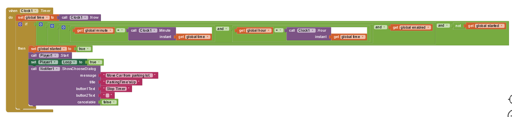

# Pillairenu_App-inventor-project

This is my MIT App inventor project repository.

## Project - LocateMyCar

**The App's Apk File:**

[LocateMyCar App's Apk](Files/LocateMyCar_Latest.apk)

**Project Details**

This app helps users remember where they parked their car by allowing them to save the location of their car in the app and later retrieve directions to their car's location.
The app also has additional features, such as sharing the location of the parked car with friends or family so that they can help find it if needed and allowing the user to set a reminder to move the car if they've parked it in a time-limited parking zone.

**Components Used:**

1.  Notifier- To show the saved location and the notification to move the car.
2.  Player - To set the alarm to move the car.
3.  LocationSensor-To get thecurrent location, such as latitude and longitude.
4.  Clock- To get the time and set the reminder alarm.
5.  sharing-To share the location with other apps installed on the device.
6.  TinyDB-To store the data (location).
7.  ActivityStarter-To open the map.

**The User Interface:**

<kbd></kbd>

**The App's Behavior:**

When the user clicks on 'Save Location' button, the location of the car will be saved.

When the user clicks on the 'Direction to Car' button, the direction to the saved location will be shown in Google Map.

When the user clicks on the 'Share Location' button, the saved location can be shared with other apps.

When the user clicks on the "SET TIMER" button, they can choose the time to get the remainder to move the car.
Then the timer will be on, and the button name will change to "TIMER IS ON." When the reminder is due, an alarm is triggered, and the "Player" component is used to play the sound file.
and a notification will be shown in the app. If the user clicks the 'Stop Timer' button in the notification, the alarm will turn off and the button name will change to 'TIMER IS OFF'. The clock component checks when the time is due.

