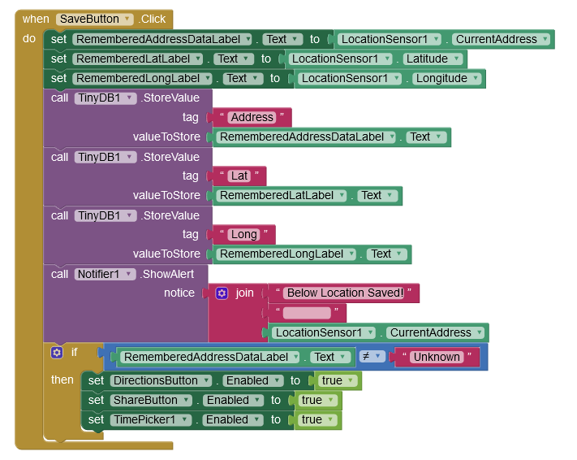

# Pillairenu_App-inventor-project

This is my MIT App inventor project repository.

## Project - LocateMyCar

For my MIT App Inventor project, first I gave importance to making my project work, and I didn't follow any MVC pattern. But I made my app work with great effort. All the features worked properly. But whenever I added a new feature or made changes to an existing feature, it was difficult to do since there was no model, view, or controller separation, and it was hard for me to debug. So I tried to implement the MVC pattern, and I believe that I have managed to separate the model, view, and controller. This modularity and separation of concerns made it easier for me to add a new feature to my app and also helped me remove unnecessary code and simplify code logic. I added a new feature to show the location history.

**The App's Latest File: After adding MVC**

[LocateMyCar App's Aia](Files/LocateMyCar_FinalVersion.aia)

**The App's Previous File: Without MVC Design Pattern**

[LocateMyCar App's Apk](Files/LocateMyCar_Latest.apk)

[LocateMyCar App's Aia](Files/LocateMyCar_Latest.aia)

**Project Details**

This app helps users remember where they parked their car by allowing them to save the location of their car in the app and later retrieve directions to their car's location.
The app also has additional features, such as sharing the location of the parked car with friends or family so that they can help find it if needed and allowing the user to set a reminder to move the car if they've parked it in a time-limited parking zone.

**Components Used:**

1.  Notifier- To show the saved location and the notification to move the car.
2.  Player - To set the alarm to move the car.
3.  LocationSensor-To get thecurrent location, such as latitude and longitude.
4.  Clock- To get the time and set the reminder alarm.
5.  sharing-To share the location with other apps installed on the device.
6.  TinyDB-To store the data (location).
7.  ActivityStarter-To open the map.

**The User Interface:**

<kbd></kbd>

**The App's Behavior:**

When the user clicks on 'Save Location' button, the location of the car will be saved.

When the user clicks on the 'Direction to Car' button, the direction to the saved location will be shown in Google Map.

When the user clicks on the 'Share Location' button, the saved location can be shared with other apps.

When the user clicks on the "SET TIMER" button, they can choose the time to get the remainder to move the car.
Then the timer will be on,the button name will change to "TIMER IS ON." When the reminder is due, an alarm is triggered and a notification will be shown in the app. If the user clicks the 'Stop Timer' button in the notification, the alarm will turn off and the button name will change to 'TIMER IS OFF'.The "Player" component is used to play the alarm and the clock component checks when the time is due.

## Enhancement

For my MIT App Inventor project, first I gave importance to making my project work, and I didn't follow any MVC pattern. But I made my app work with great effort. All the features worked properly. Then I tried to implement the MVC pattern, and I believe that I have managed to separate the model, view, and controller. This modularity and separation of concerns made it easier for me to add a new feature to my app and also helped me remove unnecessary code and simplify code logic. Additionally, I added a new feature to show the location history. It will show all the locations the user has previously parked their car. In the future, I have a plan to add another feature to show direction to the location that is selected from the history.

The Final User Interface:

Implementation of MVC pattern:

